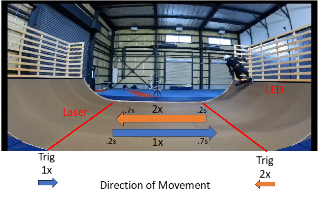

## 配布データ

配布されるデータは以下の通り.

- [配布データと応募用ファイルの説明](#配布データと応募用ファイルの説明)
  - [配布データ](#配布データ)
    - [Readme](#readme)
    - [学習用データ](#学習用データ)
    - [評価用データ](#評価用データ)
    - [スタンスファイル](#スタンスファイル)
  - [ファイルのフォーマット](#ファイルのフォーマット)

### Readme

本ファイル(readme.md)で, 配布用データの説明と応募用ファイルの作成方法を説明したドキュメント. マークダウン形式で, プレビューモードで見ることを推奨する.

### 学習用データ

`train.zip`を解凍して得られる. 各被験者(subject)ごとにmatフォーマットのデータが格納されている. 被験者は全部で5名(`subject0`,`subject1`, `subject2`, `subject3`, `subject4`)でそれぞれ3つずつ(`train1.mat`, `train2.mat`, `train3.mat`)データが格納されている. ディレクトリ構造は以下の通り.

```bash
train
├── subject0
│   ├── train1.mat
│   ├── train2.mat
│   └── train3.mat
└── ...
```

それぞれのデータは'times', 'data', 'ch_labels', 'event'をキーとして持つデータで, それぞれ時刻(単位はミリ秒), EEG測定データ, チャンネルの名称リスト, トリックが行われた履歴データである. 'data'は(チャンネル, 測定データ)という多次元配列となっている. 測定データの単位はμVで, 時間間隔は'times'と対応しており, 2ミリ秒間隔(サンプルレートが500Hz)で, チャンネルは'ch_labels'に対応しており, 全部で72チャンネルある([国際10-10法](https://commons.wikimedia.org/wiki/File:EEG_10-10_system_with_additional_information.svg)). 'event'の中身は'init_index', 'type', 'init_time'であり, それぞれインデックス, トリックの種別, イベントが起こった(トリックが行われた)時刻(単位は秒)を表す. トリックの種別の定義は以下の通り.

| トリックの種別 | 意味 |
| ---- | ---- |
| 11 | LED側の傾斜台へ向かってfrontside kickturnを行った |
| 12 | LED側の傾斜台へ向かってbackside kickturnを行った |
| 13 | LED側の傾斜台へ向かってpumpingを行った |
| 21 | Laser側の傾斜台へ向かってfrontside kickturnを行った |
| 22 | Laser側の傾斜台へ向かってbackside kickturnを行った |
| 23 | Laser側の傾斜台へ向かってpumpingを行った |



実際のデータの読み込み方などについては分析チュートリアル`tutorial.ipynb`を参照されたい.

### 評価用データ

`test.zip`を解凍して得られる. matフォーマットのデータである. 学習用と同一の被験者分格納されている(`subject0.mat`, `subject1.mat`, `subject2.mat`, `subject3.mat`, `subject4.mat`). ディレクトリ構造は以下の通り.

```bash
test
├── subject0.mat
└── ...
```

それぞれのデータは'data', 'ch_labels'をキーとして持つデータで, それぞれEEG測定データとチャンネルの名称リストである. 'data'は(サンプル, チャンネル, 測定データ)の多次元配列でサンプルレートは学習用と同じ500Hz, 'ch_labels'は学習用データと同じである. 傾斜台へ向かってトリックを行った測定データのうち0.5秒間(平面に進入した瞬間から0.2秒後~0.7秒後の間)を切り出して作成されている.

実際のデータの読み込み方などについては分析チュートリアル`tutorial.ipynb`を参照されたい.

### スタンスファイル

スタンスファイルは, 各被験者が滑走する際の体勢の向きであるボードスタンスを表しており, `stance.csv`として与えられる. 実際に作成する際に参照されたい.

## ファイルのフォーマット

サンプルID(各被験者ごとのサンプル)ごとにトリックの種別を記載したもので, **ヘッダーなし**のcsvファイルである.

- サンプルID
  - フォーマットは`subject{0,1,2,3,4}_{sample_id}`
  - 型は`str`
- トリックの種別
  - `frontside_kickturn`, `backside_kickturn`, `pumping`のいずれか
  - 型は`str`
